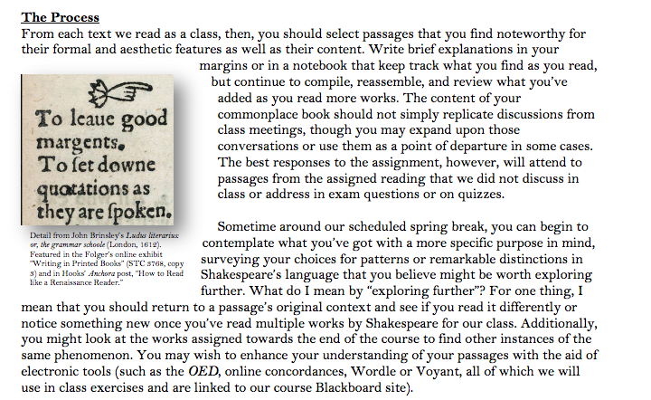
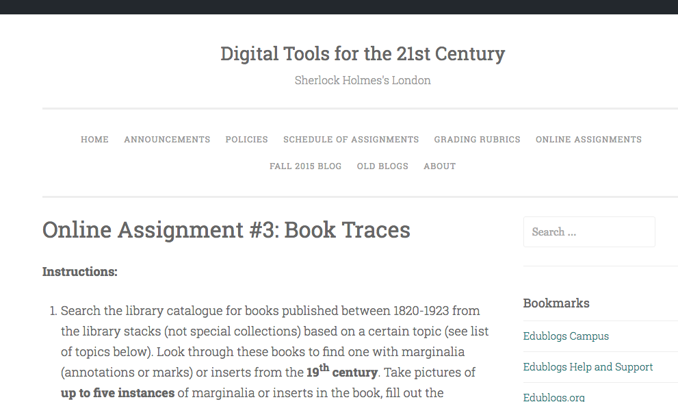
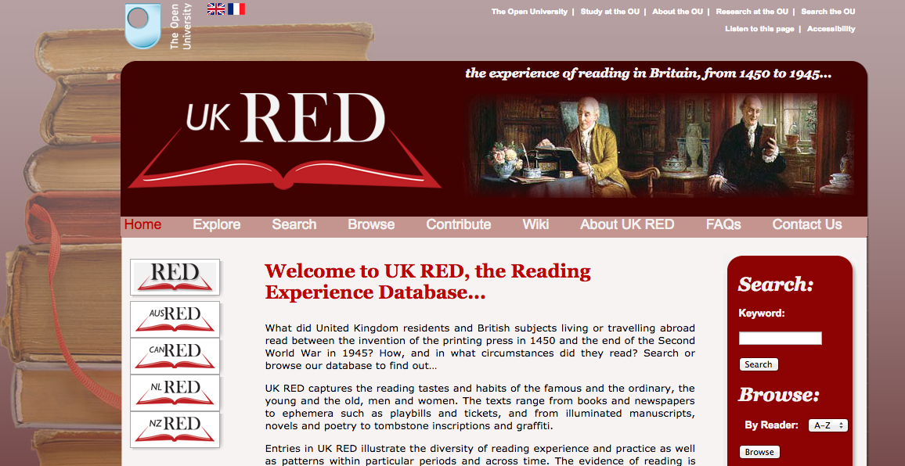
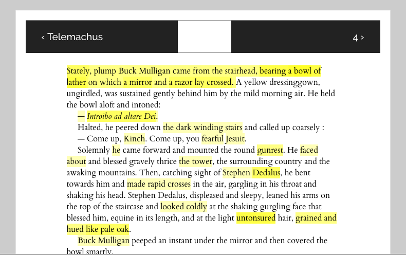

# READING [(draft)

## Rachel Sagner Buurma
Department of English Literature | Swarthmore College| [Website](http://rachelsagnerbuurma.org/)

---

##### Publication Status:
*  **unreviewed draft**
* draft version undergoing editorial review
* draft version undergoing peer-to-peer review
* published

---

## CURATORIAL STATEMENT

Reading has been transformed by digital media and computation, by the computer screen and the ereader, and e-ink - just as it was by the advent of machine printing, by the Gutenberg press, by advances in manuscript production, and the shift from scroll to codex, as well as by social and historical changes in everything from the economics of book production literacy and access to education. According to the most anxious report, this most recent transformation has destroyed our ability to read deeply, slowly, and linearly. "It is a cliché universally acknowledged," writes Rita Raley in the introduction to her "Distracted Reading" syllabus,

> that we (where “we” means, variously, the Twitter generation, the Millennial generation, participants in the Network Society) no longer read, or if we do read, we read poorly, with insufficient attention and affect. Reading, by which is meant literary reading, is said to be a “lost art” and certainly “at risk.” We multitask and thus cannot sustain the kind of focus and attention required for a long, complex narrative.

Of course, as students of reading hastily reply, we have always read discontinuously, intensively as well as extensively, and intermittently as often as in long uninterrupted stretches. Accordingly, all of the syllabi and assignments featured and referenced here - discontinuous reading via hypertext, commonplacing in digital form, the digitalization of nineteenth-century marginalia - alight on our current moment in the history of reading as an opportunity to rethink reading's history, seeking to take the measure of the continuities and discontinuities between the codex's page and the page on the screen. As Andrew Piper claims in *Book Was There: Reading in Electronic Times* (Chicago, 2012),

> If books are essentially vertebral, contributing to our sense of human uniqueness that depends upon bodily uprightness, digital texts are more like invertebrates, subject to the laws of horizontal gene transfer and nonlocal regeneration. They, like jellyfish or hydra polyps, always elude our grasp in some fundamental sense. What this means for how we read -- and how we are taken hold of by what we read -- is still far from clear. (2-3)

The fundamental uncertainty over the meaning of the addition of the distributed electronic text to a literary reading ecosystem previously defined by the "vertebral", bounded book (not to mention the printed form, the magazine, the newspaper, the manuscript, and the typescript) leads to a new pedagogical challenge for teachers whose fundamental charge is to teach students "how to read": how do we begin to teach students to understand the relationship between page and screen if we have only begun to grasp it ourselves? Thinking about the power dynamics of reading in " Jane Austen and the Secret of Style," D.A. Miller notes dangers of "being read reading."(  ) Reading in the digital age reduces none of these complications of reading's relation to identity and survival, but it raises yet another specter: the possibility that we are "being read" as data by machines as well as by humans.

These assignments rise to the challenge by taking hold of one of the most traditional aspects of humanities pedagogy: the classroom's role as a place where students and teachers create new knowledge together.

Now that we can turn on social highlight on our ereaders or upload our comments to Social Book
This seems  classroom as social
Knowledge production - knowledge about reading,

Most of these assignments work to reveal to students that reading is social even when it feels most solitary. Whether we do alone in front of  a screen, aloud in a mosque, or silently in a crowded library, reading connects us to a general history and a

The course on the history of reading in the west from scroll to codex to the ebook and computer screen is a genre in its own right; examples are Ann Blair's [History of the Book and of Reading](http://sites.fas.harvard.edu/~hist1318/), Timothy Burke's [The History of Reading](http://blogs.swarthmore.edu/burke/syllabi/history-62-the-history-of-reading-spring-2012/), and Adrian Johns's [A History of Reading]http://home.uchicago.edu/~johns/historyofreading). But the pasts, presents, and futures of reading make their way into a much wider range of syllabi,  appearing in period-specific courses (early modern readers in a Shakespeare class), and in classes ranging form book history and digital humanities to user experience, design, and information science. I should note there that I adhered fairly strictly the the "digital pedagogy" rubric, thus omitting important history of reading assignments like Sarah Werner's ["Your book's early readers and users"](http://sarahwerner.net/FolgerBooks/wp-content/uploads/2015/06/Assign3-early_users.pdf) and materiality of reading assignments like Jeffrey Makala's ["Reading By Candlelight"]https://www.academia.edu/11406932/Ways_of_Reading_Assignment_SCHC_454)

The following assignments, projects, and resources bring the continuities and disjunctions between print and digital forms to the fore, and ask students to interrogate cultural messages and social assumptions about reading - their own and others' - by historicizing reading, reflecting on their own modes of engaging with texts on and offline, and speculating on the futures of reading. Distracted, discontinuous, materialized, black-boxed, close, distant, human machine - the way we name the forms of reading we practice every day help us grasp

[Book history and digital pedagogy have shared a close relationship because, as Sarah Werner writes, digital tools have the power to "estrange ourselves from our books, to defamiliarize what we think we know, we might learn something new about how they were made and how they are used." They can bring us both closer to the physical book than we might otherwise get, and allow us to construct models of larger collections of books than we could humanly read. Stephen Ramsay, of course, has noted that one of the reasons that , and this goes for the investigation of the materiality of reading as well;]

## CURATED ARTIFACTS

### Topic: Discontinuous Reading

### "Cut/Copy/Paste: Remixing Words"

* Artifact Type: Syllabus
* Source URL: [http://whitneyannetrettien.com/whiki/index.php?title=Cut/Copy/Paste:_Remixing_Words_(Spring_2012)](http://whitneyannetrettien.com/whiki/index.php?title=Cut/Copy/Paste:_Remixing_Words_(Spring_2012))
* Artifact Permissions: CC BY-NC-SA 3.0
* Copy of the Artifact:
* Creator and Affiliation: [Whitney Ann Trettien](http://whitneyannetrettien.com/), University of North Carolina at Chapel Hill

Whitney Ann Trettien's "Cut/Copy/Paste: Remixing Words" (Duke University, Spring 2012) unsettles the apparent opposition between writing and reading, explaining to her students that "you cannot read the texts of this class without, in some sense, writing them, and we'll spend a good deal of time doing both in and out of class." Her syllabus traces the history of readers who have remixed old texts to create new experimental writing, inviting her students to from Latin cut-up poems to seventeenth-century German paper instruments to generative computer programs. Trettian's readings and exercises insistently emphasize the materiality of both page *and* screen, expertly preempting the inscription of a material/dematerialized divide between the printed and the digital book, an especially tricky aspect of digital pedagogy.

### "Theory and Practice of Hypertext"

* Artifact Type: Syllabus
* Source URL: [http://www2.iath.virginia.edu/courses/ensp482/syllabus.html)](http://www2.iath.virginia.edu/courses/ensp482/syllabus.html)
* Artifact Permissions: contacting
* Copy of the Artifact:
* Creator and Affiliation: [John Unsworth](http://people.brandeis.edu/~unsworth/), Brandeis University

Hypertext was revelatory to scholars in the humanities because it held out the possibility of rendering visible the interconnected webs of citations scholars see when they read. Courses on hypertext genres proliferated in the 1980s and 1990s - from the several still (precariously) preserved online, it's likely that scores of these courses existed. John Unsworth's ENSP 482: Theory and Practice of Hypertext (University of Virginia, Spring 1999) introduces students to the possibilities of discontinuous, non-narrative, online reading and writing.  The course begins with a brief history and how-to, moves through hypertext classic texts, and includes several weeks of project-based work before finishing with an investigation of emerging hypertext genres (critical, creative, autobiographial). Searching for hypertext course syllabi provides a sharp reminder us of how badly digital teaching materials are preserved and how quickly lost and how important it is that we work to preserve and *contextualize* our digital pedagogy materials.  Most citations or links to hypertext syllabi or assignments I could find were broken, and the student projects linked from course websites seem even less likely to survive.

### The Commonplace Book Assignment

* Artifact Type: Assignment
* Source URL: [http://jitp.commons.gc.cuny.edu/the-commonplace-book-assignment/](http://jitp.commons.gc.cuny.edu/the-commonplace-book-assignment/)
* Artifact Permissions: CC BY-NC-SA 3.0 US
* Copy of the Artifact:
* Creator and Affiliation: [Vimala Pasupathi](https://vcpasupathi.wordpress.com/), Hofstra University

This assignment reimagines the short close reading paper as a commonplace book. Early modern readers often copied out passages from their reading into notebooks to make a personal repository of extracts for future reference. Vimala Pasupathi writes in her write-up of this assignment that  "it seems to me that there is no better way to teach students about the consumption of literary works and textual forms than to have them assemble their own Commonplace books."  Connecting early modern commonplacing to contemporary uses of Pinterest and Tumblr, Pasupathi asks students to create their own commonplace book by copying out weekly passages from the assigned Shakespeare play and writing paragraph-long close readings of each passage using in "a hard-copy diary of sorts, or on the web as a blog, Tumblr, or Pinterest page."  This assignment askes students to read work by Adam Hooks and Alan Jacobs on commonplace books. Another version of the assignment might also ask students to look first at [digitized commonplace books](http://ocp.hul.harvard.edu/reading/commonplace.html) like those in the Harvard University Library Open Collections Program as examples. The assignment could be easily adapted to any class asking students to think about questions of collection, quotation, or close reading, whether centered on early modern culture or not, though it gains extra meaning in the context of a class looking at early modern reading practices. In an upper-level undergraduate or a graduate class, this assignment could scale all the way up to asking students to build and maintain a commonplace book of research or open research notebook on the model of [Whitney Ann Trettien's](http://whitneyannetrettien.com/whiki/index.php?title=Main_Page), [W. Caleb McDaniel's](http://wiki.wcaleb.rice.edu), or [Shawn Graham's](http://shawngraham.github.io/).

### Topic: Distracted Reading

### Distracted Reading

* Artifact Type: Syllabus
* Source URL: [https://engl146dr.wordpress.com/](https://engl146dr.wordpress.com/)
* Artifact Permissions: contacted author, will update
* Copy of the Artifact:
* Creator and Affiliation: [Rita Raley](http://raley.english.ucsb.edu/), University of California - Santa Barbara

In this syllabus, Rita Raley asks students to reflect on a series of large questions about the present of reading. Contrasting the kind of reading we do when we consume information or entertain ourselves online with the purportedly deep, close reading demanded in the literature classroom, Raley asks:

> What are the different modes of reading and what is their relationship to different media environments? How do contemporary works of print and electronic literature both reflect and anticipate different modes of reading? What is the place of “close reading” – still the most important basic skill taught to English majors – in a complex media ecology that encourages skimming, browsing and watching? How can we meaningfully situate our own reading practices within that same media ecology? Is all reading now distracted reading and, if so, can we still speak of rigor?

Working through different aspects of debates over and discourse about contemporary reading practices as well as turning back to historicize earlier modes of attention to the page, Raley's syllabus models the transformation of a  binarized classroom battle over students' attachment to screens vs professorial desire for deep engagement with the printed text into a generative, collaborative pedagogical undertaking.  The syllabus offers a number of extractable clusters of readings that might fit into a more general history of reading, of the book, or of electronic literature syllabus. The syllabus might also make a compelling reference for students who want to know about the debates behind something like a syllabus's policy on the use of technology in the classroom.

### Topic: Historical Traces

### Book Traces

* Artifact Type: Assignment
* Source URL: [https://hawksites.newpaltz.edu/dhm293/online-assignment-3-book-traces/](https://hawksites.newpaltz.edu/dhm293/online-assignment-3-book-traces/)
* Artifact Permissions: unclear - contacted author
* Copy of the Artifact:
* Creator and Affiliation: [Annie Swafford](https://annieswafford.wordpress.com/),  SUNY - New Paltz

In this assignment, undergraduates learn from and contribute to [Book Traces](http://www.booktraces.org/), a project that crowdsources records of marginalia from nineteenth-century books from the open stacks of libraries. Asking students to search the library catalog, locate physical books on the shelf, page through them to find marginalia, photographically document it, and finally write a short blog post explaining "what the traces have to do with the topic of the book and the pages on which they appear." The assignment also builds in an option for students who fail to find marginalia, directing them to"explain what search terms you used to find 19th century books, give some sample titles of books you looked at, and give some guesses about why books with your selected topic does not include any evidence of earlier readers." Connecting the digital library catalog with the book on the shelf and the process of digital documentation with the study if paleography, the assignment gives students a very concrete way to think about continuities and discontinuities between the annotation and documentation practices of nineteenth-century readers and their own. This assignment could be remixed or rethought to consider the traces in and of the digital facsimile, perhaps via [The Art of Google Books]http://theartofgooglebooks.tumblr.com), a Tumblr documenting the idiosyncratic materialities of facsimiles in Google Books, from the pressed flower and scribbled inscription to the library circulation slip and the hand of the scanning technician.

### Reading Experience Database UK (UK READ)

* Artifact Type: Database
* Source URL: [http://www.open.ac.uk/Arts/reading/UK/index.php](http://www.open.ac.uk/Arts/reading/UK/index.php)
* Artifact Permissions: open-access database
* Copy of the Artifact:
* Creator and Affiliation: [UK RED Project Team](), The Open University
### Topic: Machine Reading and Human Reading

UK RED "is an open-access database housed at The Open University containing over 30,000 easily searchable records documenting the history of reading in Britain from 1450 to 1945. Evidence of reading presented in UK RED is drawn from published and unpublished sources as diverse as diaries, commonplace books, memoirs, sociological surveys, and criminal court and prison records." A mine of primary material with about reading including careful metadata about reader, author, text, and place, the growing UK RED database could be the basis for assignments comparing the reception history of a single text across time, tracking the reading of individual readers, or looking at many readers' responses to a single text.

### Infinite Ulysses

* Artifact Type: Database
* Source URL: [http://www.infiniteulysses.com/](http://www.infiniteulysses.com/)
* Artifact Permissions: CC BY-NC-SA 3.0
* Copy of the Artifact:
* Creator and Affiliation: [Amanda Visconti](http://literaturegeek.com), The Open University
### Topic: Machine Reading and Human Reading

Scholars and students of the history of reading have disproved - over and over again - Benedict Anderson's famous description of reading as something that always takes place "in silent privacy, in the lair of the skull." [Add IC citation.] Digital platforms, tools, and practices have made reading's public effects and traces more accessible than ever, both by providing new ways for readers to intentionally capture and share comments and conversations (comment functions, annotation apps, social bookmarking, and article sharing) and by the sometimes less intentional and desirable capture of our reading histories by our web browsers. Amanda Visconti's  Infinite Ulysses - which began [as a dissertation](http://literaturegeek.com/tag/infinite-ulysses/) - offers a platform for possible assignments that students by asking them to help socially annotate Joyce's famously difficult book. But it also acts as a model for other possible annotation projects. Asking students to use hypothes.is to collectively annotate a course reading as Jack Dougherty does in his [How to annotate with Hypothes.is assignment](http://commons.trincoll.edu/cssp/seminar/annotate-with-hypothesis/), or designing an assignment in which students create plain-text footnotes for a chapter of a contemporary novel, are other ways one could capture the spirit of *Infinite Ulysses* in a lightweight assignment.

### Topic: Machine Reading and Human Reading

### Digital Markdown Edition of a Poem

* Artifact Type: Assignment
* Source URL: [https://www.academia.edu/5947912/Assignment_Markdown_Digital_Edition_of_a_Poem](https://www.academia.edu/5947912/Assignment_Markdown_Digital_Edition_of_a_Poem)
* Artifact Permissions: contacting author
* Copy of the Artifact:
* Creator and Affiliation: [Shawna Ross](http://www.shawnaross.com/),  Texas A & M University

Ross's digital edition assignment asks students to think about active reading. Students choose a poem from the class syllabus and create a full digital edition ready for online publication, includingcareful transcription of the bio, an author biography, bibliography, introduction to the poem’s cultural and historical contexts, and at least fifteen word annotations. Asking students to "think beyond the word processor," Ross creates an additional layer of engagement by requiring that the text be Markdown-formatted, an aspect of the assignment that requires students to think about the relation between form and content in online writing. Revising this assignment to include more engagement with plain-text authoring conventions like Markdown could draw on parts of Programming Historian's [Sustainable Authorship in Plain Text using Pandoc and Markdown](http://programminghistorian.org/lessons/sustainable-authorship-in-plain-text-using-pandoc-and-markdown) tutorial by Dennis Tenen and Grant Wythoff. Another version of this exercise could use TEI encoding to engage students in a similar slow, active creation of an edited text and provoke some related meditations on textual encoding's relation to literary meaning and interpretation. Kate Singer's [Digital Close Reading: TEI for Teaching Poetic Vocabularies](http://jitp.commons.gc.cuny.edu/digital-close-reading-tei-for-teaching-poetic-vocabularies/) offers one good example. This assignment also suggests a flipped version: an exercise in which students would close read a marked-up text or even a snippet of code rather than using markup or encoding to close read.

### How to Not Read a Victorian Novel

* Artifact Type: Article
*Artifact Type: Assignment
* Source URL: [http://fsu.digital.flvc.org/islandora/object/fsu%3A207269](http://fsu.digital.flvc.org/islandora/object/fsu%3A207269)
* Artifact Permissions: ? in FSU Digital Repository
* Copy of the Artifact:
* Creator and Affiliation: [Paul Fyfe](http://english.chass.ncsu.edu/faculty_staff/pcfyfe),  North Carolina State University

In this article, published in the *Journal of Victorian Culture* 16.1 (Spring 2011), Paul Fyfe outlines an assignment in which he uses ready-made and freely-available online text analysis and visualizations tools to teach students how to create and interpret models of the text of a single Victorian novel. Asking students to slowly and deliberately move through the steps of text selection, preparation, model creation, and interpretation, Fyfe helps his students slow down to close read, and engages them in "self-conscious reflections about the limits, contingencies, and opportunities of alternative modes of interpretation." The assignment could be adapted to any text-based humanities course, and works especially well to interrogate the apparent divide between close and distant reading and to open up questions of canon creation and readerly attention. The original assignment Fyfe describes in the article used the no longer supported [TAPoRware](http://taporware.ualberta.ca), but the [Voyant 2.0 tools](http://voyant-tools.org/) and would plug into this assignment just as well or better.

### How to NOT Read Hemingway

* Artifact Type: Assignment
* Source URL: [http://www.briancroxall.net/s15dh/assignments/how-to-not-read-hemingway/](http://www.briancroxall.net/s15dh/assignments/how-to-not-read-hemingway/)
* Artifact Permissions: Copyright © 2016 Intro to DH. All Rights Reserved. Contact Brian? Remove/replace?
* Copy of the Artifact:
* Creator and Affiliation: [Brian Croxall](http://www.briancroxall.net/),  Brown University

This interconnected series of assignments builds on some of the same concepts as Fyfe's and extends them into the realm of copyrighted texts. Moving from print to pixel to text analysis, in assignment Croxall and his students create a machine-readable corpus of Hemingway's works by disbinding, scanning, OCR-ing, and cleaning Hemingways's ouvre before using Voyant to analyze them. Taking students through the creation of the digital facsimile and the machine-readable text shows how difficult, interpretive, and iterative the preparatory steps of computational text analysis can be.

## RELATED MATERIALS

In MLA format, list five related items that are informative for teaching with your keyword in mind. **Please only include five items. No more, no less.**

For each item, include Author, Title, and URL, in alphabetical order.

Items may include, but are not limited to:
* Scholarly journal article
* Book
* Video, audio, or other dynamic media
* Crowdsourced document
* Blog post

Sarah Warner on Where Material Book Culture Meets Digital Humanities http://journalofdigitalhumanities.org/1-3/where-material-book-culture-meets-digital-humanities-by-sarah-werner/

## WORKS CITED

A works cited for all references in your entry, including your ten artifacts, your five related materials, and anything referenced in your curatorial statement in MLA style.

*Book Was There: Reading in Electronic Times* (Chicago, 2012),

Sarah Warner on Where Material Book Culture Meets Digital Humanities http://journalofdigitalhumanities.org/1-3/where-material-book-culture-meets-digital-humanities-by-sarah-werner/

